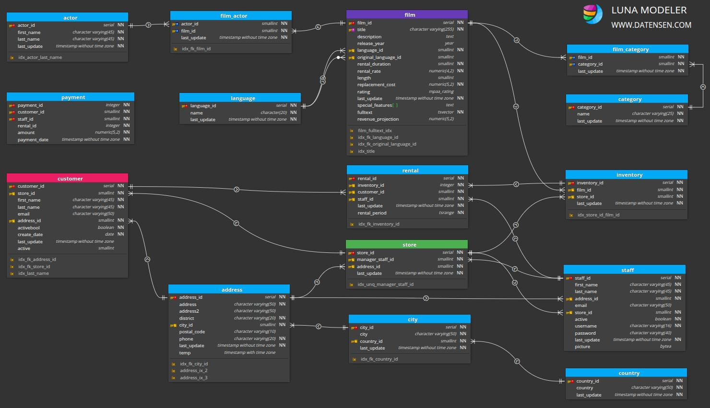

# 🤖 Enterprise Text-to-SQL AI Agent (Privacy-First)

Un Agente de Inteligencia Artificial 100% local diseñado para el sector corporativo, capaz de traducir preguntas de negocio en lenguaje natural a consultas SQL complejas, ejecutarlas y visualizar los resultados sin exponer datos confidenciales a la nube.

##  El Problema de Negocio (Soberanía de Datos)
Las gerencias necesitan respuestas rápidas a partir de sus bases de datos transaccionales (Ej. "Top clientes por ingresos", "Análisis de morosidad"). Sin embargo, instituciones financieras y corporaciones no pueden enviar sus esquemas de bases de datos ni datos de clientes a APIs públicas (como OpenAI) por estrictas normativas de seguridad y privacidad (Compliance).

##  La Solución Arquitectónica
Este proyecto implementa una arquitectura **RAG (Retrieval-Augmented Generation) aplicada a Tablas Estructuradas**. Utiliza un modelo fundacional Open Weights especializado en código, ejecutado localmente, que analiza dinámicamente los metadatos de PostgreSQL para generar consultas SQL precisas al instante.

###  Características Clave
* **100% Data Privacy:** El LLM corre en local mediante `Ollama`. Ni el esquema de la base de datos ni los registros de los clientes salen del servidor de la empresa.
* **Inferencia Dinámica del Esquema:** El agente hace un barrido de `information_schema` en tiempo real. Si se agrega una nueva tabla a la base de datos, la IA la reconoce automáticamente sin reentrenar el modelo.

* **Manejo de Lógica Compleja:** Capaz de resolver consultas de Nivel, incluyendo múltiples `INNER/LEFT JOINs`, agregaciones, filtrado por ausencia de datos, etc.
* **UI/UX Corporativa:** Interfaz gráfica desarrollada para usuarios de negocio (no técnicos) que muestra la consulta generada para auditoría y renderiza los resultados en DataFrames interactivos.

## 🛠️ Stack Tecnológico
* **Motor de Base de Datos:** PostgreSQL (Desplegado en entorno Linux/Ubuntu).
* **Base de Datos de Prueba:** Esquema relacional **Pagila** (15 tablas altamente normalizadas que simulan un entorno ERP/Financiero).
* **Inteligencia Artificial (LLM):** DeepSeek-Coder 6.7B (Vía Ollama).
* **Backend & Integración:** Python, `psycopg2` (Driver de conexión), `requests`.
* **Frontend (Data App):** Streamlit, Pandas.

##  Cómo ejecutar este proyecto localmente
1. Levantar el modelo local: `ollama run deepseek-coder:6.7b`
2. Instalar dependencias: `pip install streamlit pandas psycopg2-binary`
3. Iniciar la aplicación web: `streamlit run app.py`

---
> **Autor:** Jimmy Cjuro A.
> *Estudiante de Ingeniería de Sistemas y Software | UNMSM*
> *Desarrollador enfocado en Data Engineering y Soluciones de IA aplicadas a la Industria.*